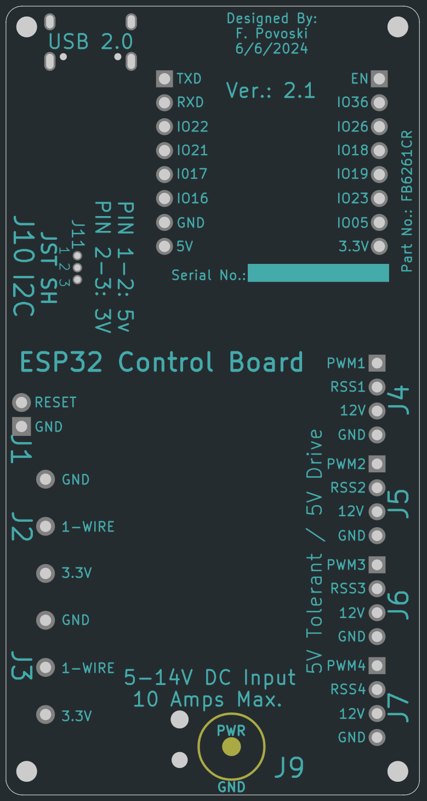

# VERSION 2.1 UPDATED WITH NEW FEATURES 
### BUY - https://www.tindie.com/products/28875/

## Description
ESP32 based board for addressable LED control in 3D printer enclosures, audio-visual racks, and computer/networking racks. This ESP32 board features, the powerful ESP-WROOM-32E module, with integrated WiFi and Bluetooth functionality (BR/EDR/BLE). The ESP32 is a chip designed with TSMC ultra-low power management technology. The proven ESP32-D0WD-V3 chip is located in the core of the developed module. This board has a USB-C interface for download of firmware and power during development. The board is flashed with an ESPHome image to allow immediate inclusion onto your WiFi network and OTA programming. It also has headers that allow use with conventional D1 Mini style daughter boards and is therefore pin compatible with most accessories. The board has a JST SH connector with I2C and selectable (3.3/5V) power and ground compatible with Adafruit's STEMMA QT/ Sparkfun Qwiic sensors. With optional JST SH to JST PH cable, it also supports STEMMA and Grove interfaces This board also has four Molex KK (PC fan style) that has one 5v driven output, one 5v tolerant input, in addition to fan (typ. 12v) power and ground for 4+ amps per connector and up to 10 amps for all four connectors. It also has three, 2-pin screw connector for one-wire devices, each with 3.3v power and ground.

 

## Specifications:

* Size: 84mm x 44mm with 2mm mounting holes
* Processor: ESP32 on ESP32-WROOM-E module with WiFi and BT V4.2
* Power Input: 12v @ 10 amps max via 5.5mm x 2.1/2.5mm barrel connector or 5v via USB-C connector.
* 10 amp resettable fused input power.
* On Board Regulation: 5v @ 2 amps switching regulator, 3.3v @ 1.0 amp.
* Input/Output: One 5v tolerant input (1k pullup) and one 5v driven output, with 12V power (4+ amps per conn.) and ground on four, four-pin Molex KK series connectors.  Adaptor cable is included to drive
* I/O: Three screw down three position headers with common one-wire interface as well as 3.3v power and ground.
* I/O: USB 2.0 via USB-C connector using the CP2102N.
* I/O: Standard WEMOS daughter interface on two 1x8 pin headers.
* I/O: JST SH connector w/ I2C/PDM interface 3.3v/5.0v selectable power (compatible with Adafruit's STEMMA QT/ Sparkfun Qwiic sensors).
* Add-ons: Relay - uses GPIO18 mapped to the WEMOS daughter interface.

A 3D printed enclosure is also available: https://www.tindie.com/products/29364/

## Setup and Configuration

* DO NOT ATTEMPT TO POWER 5 VOLT  LEDS FROM USB-C. Supplied LED power (5v-14V) needs to 
be connected barrel connector and needs to match the voltage of the
LEDS (or other device) you are powering

* Device is flashed with the WLED. To place on 
WiFi network use 2.4G phone to connect to "WLED-AP" and default WLED password. . Once connected to your WiFi network, to access the webpage of
the device browse to http://wledecb.local.  WiFi credentials can aslo be set using the  WLED Web
Flasher https://install.wled.me/

* If customization is needed, follow the WLED instructions for compiling your own image. Custom images are available for dual LED and 
Dallas temperature fan control, as well as sound reactive.

* URL of the board is: http://wledecb.local

* Flash over USB or ethernet. To flash over USB use WLED Web Flasher https://install.wled.me/
with the device powered and connected to your host machine.

* Also update WiFi and MQTT server credentials as required.

* For adding Wemos style boards (i.e., relay) with the case installed use the long (19mm).

* WLED Quick Pin Settings - J4:GPIO13, J5:GPIO14, J6:GPIO25, J7:GPIO32, Relay:GPIO18, Dallas:GPIO27,
   J10.PIN3(SDA): GPIO21, J10.PIN4(SCL): GPIO22

## Connector to GPIO Mapping.

### Open Collector 2.54mm Header Connector 
| CONNECTOR | PIN1 | PIN2 |
| --------- | ---- | ---- | 
| J1 | GND | IO26(OC) |

### Dallas One-wire Screw Terminal Connectors J2-J3
| CONNECTOR | PIN1 | PIN2 | PIN3 |
| --------- | ---- | ---- | ---- |
| J2 | +3.3V | IO27 | GND |
| J3 | +3.3V | IO27 | GND |

### PWM Fan/LED KK Style Connectors J4-J7
- PIN3 - Input 5V tolerant with 1K pullup resistor
- PIN4 - Output 5V drive.
- PWR - Matches input voltage on J9. Rated to 7 amps.
			
| CONNECTOR | PIN1 | PIN2 | PIN3 | PIN4 |
| --------- | ---- | ---- | ---- | ---- |
| J4 | GND | PWR | IO33 | IO13 |
| J5 | GND | PWR | IO34 | IO14 |
| J6 | GND | PWR | IO35 | IO25 |
| J7 | GND | PWR | IO39 | IO32 |

### USB-C Connector J8
- USB 2.0, 5V, 2amps.

### Power Jack Connector J9
- +5-14V 10 amps max.
- Directly supplies J4-J7 PWR
- Must match your fan or LED voltage.

| CONNECTOR | Center | Perimeter |
| --------- | ---- | ---- |
| J9 | GND | +5-14V | GND |

### I2C/PDM JST SH Connector J10
- Direct Interface for STEMMA and QWIIC boards typically using I2C or PDM.
- Available for other functions than I2C or PDM.
- PWR - Either +3.3V or +5.0V selectable by J11.

| CONNECTOR | PIN1 | PIN2 | PIN3 | PIN4 |
| --------- | ---- | ---- | ---- | ---- |
| J10 | GND | PWR | IO21/SDA/PDMDATA | IO22/SCL/PDMCLK |

### Power Selection J11
- Voltage level selection for J10.
- Jumper Pin 1 and 2: +5V
- Jumber Pin 3 and 2: +3.3V

| CONNECTOR | PIN1 | PIN2 | PIN3 |
| --------- | ---- | ---- | ---- |
| J11 | +5V | J10.1 | +3.3V |
  
### WeMos D1 Mini Plug P1 and P2

| CONNECTOR | PIN1 | PIN2 | PIN3 | PIN4 | PIN5 | PIN6 | PIN7 | PIN8 |
| --------- | ---- | ---- | ---- | ---- | ---- | ---- | ---- | ---- |
| P1 | +5V | GND | IO16 | IO17 | IO21 | IO22 | RXD/IO03 | TXD/IO01 |
| P2 | +3.3V | IO05 | IO23| IO19 | IO18 | IO26 | IO36 | EN |

## Customer Created Projects Utilizing The ECB
Ando Roots: https://www.printables.com/model/702072-1u-rack-fan-shelf
